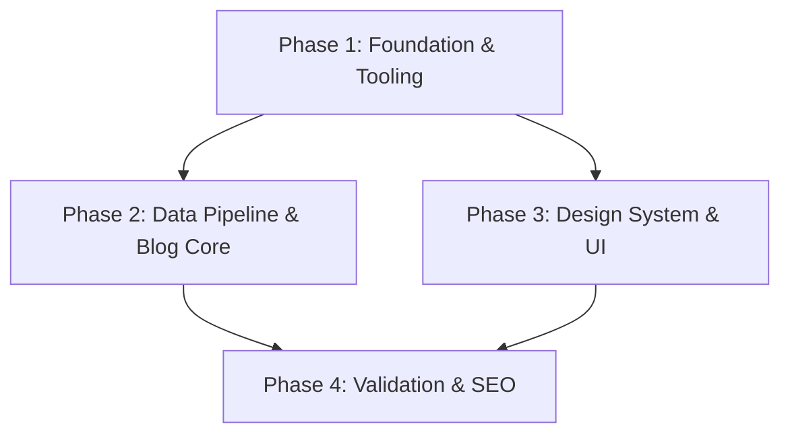

# Implementation Plan: Core Eleventy Site with Blog & Publications

**Date**: 2026-03-31
**Topic**: homepage-v2-core-20260331
**Task Complexity**: Medium

## 1. Plan Overview
- **Total Phases**: 4
- **Agents Involved**: architect, coder, design_system_engineer, tester
- **Estimated Effort**: ~10-12 total turns across all agents

## 2. Dependency Graph

## 3. Execution Strategy Table
| Phase | Agent | Files Modified | Parallel | Blocks |
|---|---|---|---|---|
| 1 | architect | package.json, .eleventy.js | No | 2, 3 |
| 2 | coder | src/data/publications.11tydata.js, .github/workflows/deploy.yml | Yes (with P3) | 4 |
| 3 | design_system_engineer | src/_includes/layouts/*.njk, src/assets/css/main.css | Yes (with P2) | 4 |
| 4 | tester | sitemap.xml, robots.txt | No | - |

## 4. Phase Details

### Phase 1: Foundation & Tooling (architect)
**Objective**: Initialize the Eleventy project and project structure.
- **Files to Create**:
  - `package.json`: Include `eleventy` and `bibtex-parse-js` as dependencies.
  - `.eleventy.js`: Standard 11ty config (input: `src`, output: `_site`).
  - `src/index.njk`: Base home page placeholder.
- **Validation**: `npm install && npx @11ty/eleventy --dryrun`

### Phase 2: Data Pipeline & Blog Core (coder)
**Objective**: Build the publication parsing logic and technical blog foundation.
- **Files to Create**:
  - `src/data/publications.bib`: Initial sample BibTeX entries.
  - `src/data/publications.11tydata.js`: The JS parser using `bibtex-parse-js`.
  - `src/posts/first-post.md`: Sample blog entry with frontmatter.
  - `.github/workflows/gh-pages.yml`: Automated deploy to GitHub Pages.
- **Validation**: Run `npx @11ty/eleventy` and check if `_site/posts/first-post/index.html` exists.

### Phase 3: Design System & UI (design_system_engineer)
**Objective**: Create the Nunjucks layouts and global BEM-based styles.
- **Files to Create**:
  - `src/_includes/layouts/base.njk`: Main layout with HTML5 boilerplate.
  - `src/_includes/macros/pub-item.njk`: Macro for rendering citations.
  - `src/assets/css/main.css`: Single global CSS file with BEM classes.
  - `src/publications/index.njk`: The publication list page.
- **Validation**: Manual check of visual consistency in `_site/publications/index.html`.

### Phase 4: Validation & SEO (tester)
**Objective**: Verify performance, accessibility, and SEO metrics.
- **Files to Create**:
  - `src/sitemap.njk`: Dynamic sitemap generation.
  - `src/robots.txt`: Search engine instructions.
- **Validation**: Run Lighthouse audits and ensure 0 broken links in the final build.

## 5. File Inventory
| Path | Phase | Purpose |
|---|---|---|
| `package.json` | 1 | Dependency management |
| `.eleventy.js` | 1 | Eleventy configuration |
| `src/data/publications.11tydata.js` | 2 | BibTeX parsing logic |
| `src/_includes/layouts/base.njk` | 3 | Core site template |
| `src/assets/css/main.css` | 3 | Global styles (BEM) |

## 6. Execution Profile
- **Total phases**: 4
- **Parallelizable phases**: 2 (Phase 2 and Phase 3 can run in parallel)
- **Sequential-only phases**: 2 (Phase 1 and Phase 4)

## 7. Cost Estimation
| Phase | Agent | Model | Est. Input | Est. Output | Est. Cost |
|-------|-------|-------|-----------|------------|----------|
| 1 | architect | Pro | 3.5K | 1K | $0.08 |
| 2 | coder | Pro | 4K | 1.5K | $0.10 |
| 3 | design_system_engineer | Pro | 4K | 2K | $0.12 |
| 4 | tester | Pro | 5K | 1K | $0.09 |
| **Total** | | | **16.5K** | **5.5K** | **$0.39** |
